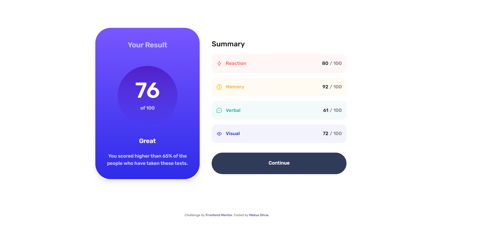
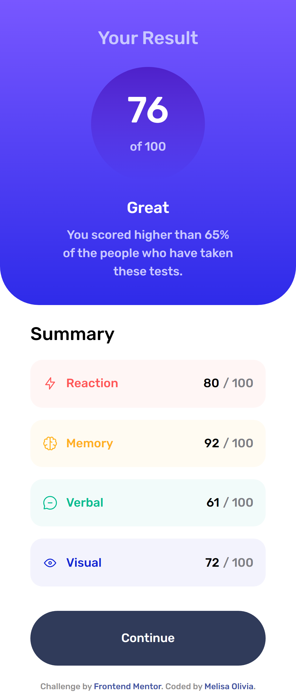

# Frontend Mentor - Results summary component

## Welcome! 👋

Thanks for checking out my front-end coding challenge.

Frontend Mentor challenges help you improve your coding skills by building realistic projects.

## The challenge

Users should be able to:

- View the optimal layout for the interface depending on their device's screen size
- See hover and focus states for all interactive elements on the page

## Links

- Live Site URL: [Result Summary Component](https://melisaolivia.github.io/result-summary-component/)
- My Github Profile : [Melisa Olivia](https://github.com/melisaolivia)

## My process

It's a fun process to solve this challenge! I learn more about javascript. How to accessing the property inside the object and made them element with the style of course. I'm learning how to calculate the average from the score and how to using switch statement, example like when I get score more 90, the text content will Awesome, and if get more than 80, I'll get really great, and the other.

## Screenshot 

### Built with

- Semantic HTML5 markup
- Flexbox
- CSS Grid
- Mobile-first workflow
- Javascript
- [TailwindCSS](https://tailwindcss.com/)

**Thank You!** 🚀
